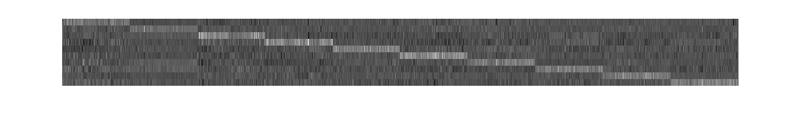

# arc_cosine_kernels
Experimentation with arccosine kernels, with a softmax perceptron for classification, and a use of isomap. Based on the paper Kernel Methods for Deep Learning by Youngmin Cho and Lawrence K. Saul.

A distance matrix for the COIL-100 dataset.

and the corresponding ISOMAP embedding with 50 neighbors.

Now, a distance matrix for a training subset of the MNIST dataset.

and the corresponding ISOMAP embedding with 50 neighbors.

And the error plot for the training of a softmax layer over the kernels, a crude approximation for a multiclass SVM.

and the W obtained:

